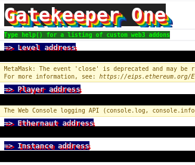
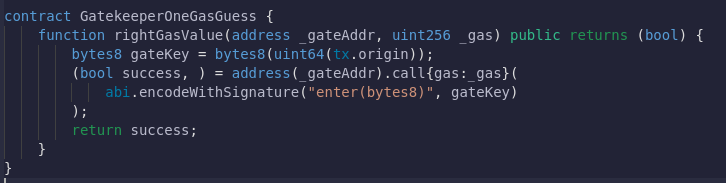
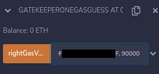
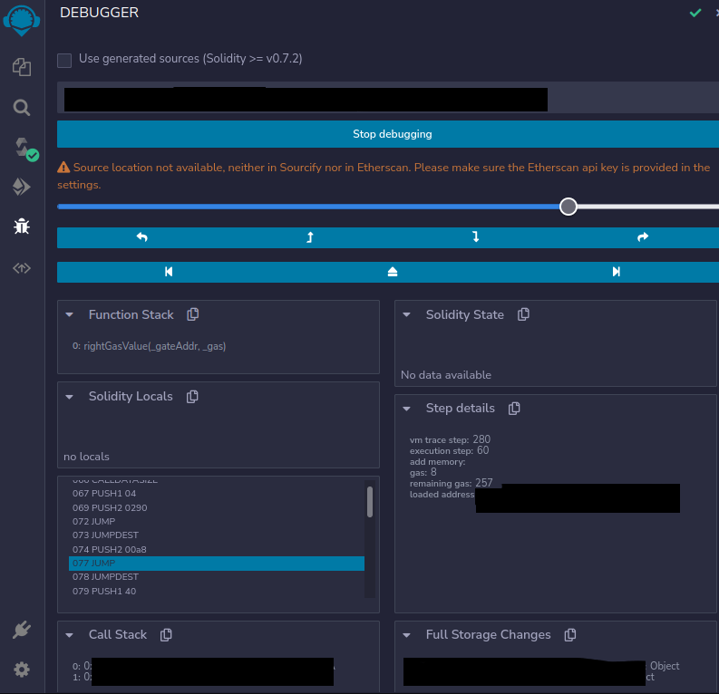
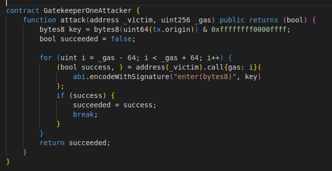
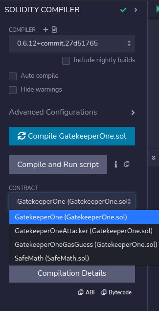
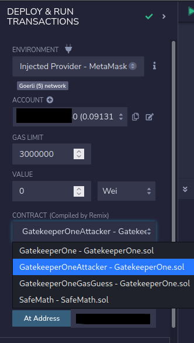
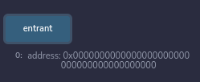
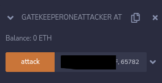
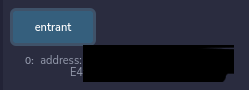

# 13: GatekeeperOne :triangular_flag_on_post:#1
The Ethernaut is a Web3/Solidity based wargame inspired by overthewire.org, played in the Ethereum Virtual Machine, in which each level is based on a smart contract that needs to be "hacked".

This is a sample walkthrough for the level called "GatekeeperOne".

## Setup :beginner:
First off we need a wallet. Get the Metamask Wallet from https://metamask.io/ and choose whichever network works for you ( in my case i will be using Goerli's testnet).
Fund the wallet with Alchemy's faucet https://goerlifaucet.com and then click on the button "Get new instance" to deploy the contract.

## Steps for completing the level   :star:
Click on F12 to get on Developer Tools. You will get something like this:

Copy the GatekeeperOne.sol contract found before "submit instance" and "get new instance" buttons.

Go on Remix: https://remix.ethereum.org/ and make these next changes in GatekeeperOne.sol.:
>- <value> 1. Pragma version from **0.6.0** to **0.6.12**

And at SafeMath.sol:
>- <value> 1. Pragma version from **0.8.0** to **0.6.12** 

This level asks us pass all the 3 gates to become an entrant. Let's start with the first requirement then advance to the last one.

For the first gate we are going to use the same trick from the [04-Telephone](https://github.com/Spyro7883/04-Telephone) level.

We are going to create a new contract called GatekeeperOneAttack, who's gonna call the enter function with our contract's attack function:
>- <value> bytes8 key = bytes8(uint64(tx.origin))
>- <value> bool succeeded = false;
>- <value> (bool success, ) = address(_victim).call{gas: i}(
>- <value> abi.encodeWithSignature("enter(bytes8)", key));
>- <value> if (success) {succeeded = success; break;} }
>- <value> return succeeded;

Now for the second gate we are going to try and guess the right amount we need to pass on this gate. First on let's deploy the GatekeeperOneGasGuess contract:

Use the rightGasValue function and set as parameters your instance's address and a random gas value to test, for example 90000: 

Now use the Debugger with the transaction hash that has been generated and search PUSH2 & JUMP opcodes using ctrl+f:

Looks like the remaining gas is 257. The total amount of gas we are going to use is equal to:
>- <value> totalGas = remainingGas + multiplier_of_8191
>- <value> 65785 = 257 + 8191 * 8

The function for gate two should look something like this:

The third gate is the most troblesome in this level. For the first requirement we are going to remove some digits:
>- <value> Let's say our example will be gate_three_key == 0x1234567890123456789012345678901234567890

We are going to keep only the last 8 bytes of our address, since it's a uint conversion:
>- <value> gate_three_key == 0x5678901234567890

Which means that uint32(uint64(gate_three_key)) will be equal to 34 56 78 90.

To satisfy the first requirement we woul need to use a bitwise operator called **AND**:
>- <value> 34 56 78 90 == 78 90 <=> 78 90 = 34 56 78 90 & 00 00 ff ff

In the second requirement is a little different since the mentioned args have to be different:
>- <value> 34 56 78 90 != 56 78 90 12 34 56 78 90 <=> 56 78 90 12 34 56 78 90 != 00 00 00 00 34 56 78 90 & ff ff ff ff 00 00 ff ff

The last requirement is the same as the first one:
>- <value> That should mean that 34 56 78 90 == 78 90 <=> 78 90 = 34 56 78 90 & 00 00 ff ff

Let's create the GatekeeperOneAttacker contract:

Compile the GatekeeperOne.sol contract:

Now let's interact with the already deployed contract by using instance's address showed on Developer Tools and deploy our GatekeeperOneAttack contract on Goerli Testnet. Also, dont forget to add your wallet on Environment by selecting "Injected Provider - Metamask".

Check the entrant function:

Use the attack function of our contract with the victim's address (instance's address) and the totalGas we calculated: 

Try again the entrant function:

Wow, congrats!! You have managed to pass all three gates, became an entrant and also have completed this level.

Now finish the level by using the submit button at the bottom of the page.

Congrats! See you on to the next level.:wave: